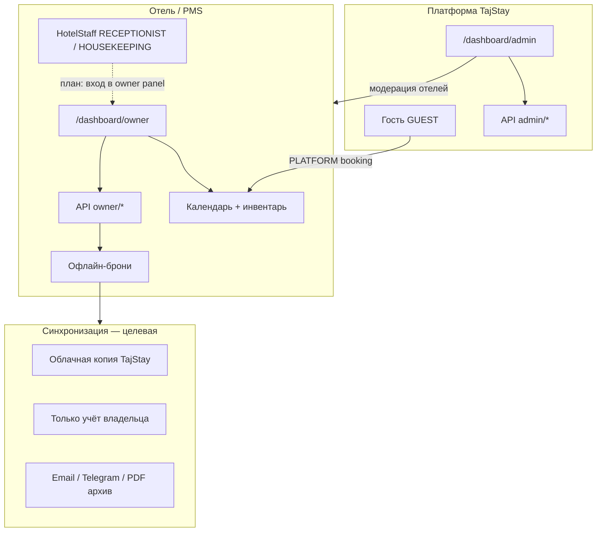
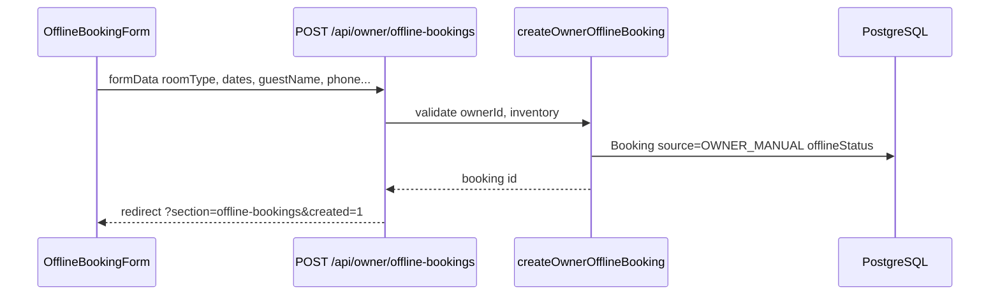
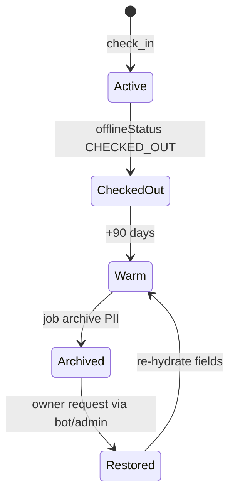

# TajStay PMS — архитектура, роли, синхронизация, архив

Документ для разработчиков: описывает **целевую логику** панели владельца, персонала отеля, офлайн-броней и синхронизации.  
Раздел **«Статус в коде»** фиксирует, что уже реализовано в репозитории, а что запланировано.

Связанные файлы:

| Тема | Путь в репозитории |
|------|-------------------|
| Права персонала отеля | `src/lib/pms/staff.ts` |
| Маскирование офлайн-данных | `src/lib/pms/offlinePrivacy.ts` |
| Настройки синхронизации владельца | `src/lib/pms/ownerPmsSettings.ts` |
| Офлайн-бронь (создание) | `src/lib/services/ownerOfflineBooking.ts` |
| Панель владельца | `src/app/dashboard/owner/` |
| Панель админа платформы | `src/app/dashboard/admin/` |
| Мобильная оболочка админа | `src/components/admin/mobile/` |
| Мобильная оболочка владельца | `src/components/owner/mobile/` |
| Схема БД | `prisma/schema.prisma` |

---

## 1. Обзор системы

### 1.1 Назначение

TajStay PMS (Property Management) — слой управления отелем **поверх** маркетплейса бронирований:

- **Онлайн-брони** (`Booking.source = PLATFORM`) — гость бронирует через сайт, оплата/чат/модерация платформы.
- **Офлайн-брони** (`Booking.source = OWNER_MANUAL`) — владелец или персонал вносит гостя вручную; жизненный цикл в `offlineStatus`.
- **Календарь занятости** — единый источник правды по датам (онлайн + офлайн блокируют слоты).
- **Разделение данных** — операционные поля для персонала vs конфиденциальный архив только у владельца.

### 1.2 Ключевые модули



| Модуль | URL / точка входа | Кто использует |
|--------|-------------------|----------------|
| **Панель владельца** | `/dashboard/owner?section=…` | `User.role = OWNER` (сейчас) |
| **Панель помощника** | тот же URL + RBAC по `HotelStaff` | `RECEPTIONIST`, `HOUSEKEEPING` (план) |
| **Панель администратора** | `/dashboard/admin?section=…` | `User.role = ADMIN` |
| **Система синхронизации** | `HostProfile.pmsSettings` + jobs (план) | только владелец отеля |
| **Гостевой кабинет** | `/dashboard/bookings`, `/profile` | `GUEST` |

### 1.3 Два уровня ролей (важно)

В коде **не путать**:

1. **`User.role`** — роль на уровне платформы: `GUEST` | `OWNER` | `ADMIN`.
2. **`HotelStaff.staffRole`** — роль сотрудника **внутри конкретного отеля**: `RECEPTIONIST` | `HOUSEKEEPING`.

Владелец (`OWNER`) не имеет строки в `HotelStaff` — он владеет отелем через `Hotel.ownerId`.

---

## 2. RBAC — роли, иерархия, разрешения

### 2.1 Терминология (продукт ↔ код)

| Термин в ТЗ / UI | В коде | Область |
|------------------|--------|---------|
| **Владелец** | `User.role = OWNER` | Все свои отели |
| **Помощник** (ресепшен) | `HotelStaff.staffRole = RECEPTIONIST` | Один `hotelId` |
| **Помощник** (уборка) | `HotelStaff.staffRole = HOUSEKEEPING` | Один `hotelId` |
| **Модератор** | `User.role = ADMIN` | Вся платформа |
| **Гость** | `User.role = GUEST` | Бронирование, профиль |

> **«Модератор отеля»** как отдельная роль в БД **пока не существует**.  
> Если нужен сотрудник с расширенными правами, но без доступа к паспортам — добавить, например, `HotelStaff.staffRole = MANAGER` и матрицу в `staff.ts`.

### 2.2 Иерархия (кто кого перекрывает)

```
ADMIN (платформа)
  └── может всё в рамках модерации (отели, пользователи, брони платформы)
OWNER (владелец отеля)
  └── полные права PMS на свои Hotel.ownerId = userId
HotelStaff (привязка hotelId + userId)
  └── только разрешения из ROLE_PERMISSIONS[staffRole]
GUEST
  └── нет доступа к /dashboard/owner и /dashboard/admin
```

**Правило:** при проверке API всегда: `resolveHotelAccess(userId, user.role, hotelId)` → `permissions[]` → `hasPermission(permissions, "…")`.

### 2.3 Матрица разрешений (`StaffPermission`)

Источник: `src/lib/pms/staff.ts`.

| Permission | OWNER | ADMIN* | RECEPTIONIST | HOUSEKEEPING |
|------------|:-----:|:------:|:------------:|:------------:|
| `assign_rooms` | ✅ | ✅ | ✅ | — |
| `check_in_out` | ✅ | ✅ | ✅ | — |
| `offline_booking` | ✅ | ✅ | ✅ | — |
| `view_calendar` | ✅ | ✅ | ✅ | ✅ |
| `view_finances` | ✅ | ✅ | — | — |
| `view_guest_pii` | ✅ | ✅ | — | — |
| `change_housekeeping` | ✅ | ✅ | — | ✅ |
| `manage_rooms` | ✅ | ✅ | — | — |

\* ADMIN в `resolveHotelAccess` сейчас получает полный набор `OWNER_PERMISSIONS` для любого `hotelId` (модерация платформы).

### 2.4 Что видит каждая роль в офлайн-бронях

Реализовано в `src/lib/pms/offlinePrivacy.ts` + UI `OfflineBookingsList` / `OfflineBookingStaffSearch`.

| Поле | OWNER | RECEPTIONIST | HOUSEKEEPING |
|------|:-----:|:------------:|:--------------:|
| Имя гостя (поиск) | ✅ | ✅ | — |
| Даты заезд/выезд | ✅ | ✅ | календарь |
| Категория / тип номера | ✅ | ✅ | — |
| № комнаты (`roomNumber`) | ✅ | ✅ | — |
| Статус `offlineStatus` | ✅ | ✅ (редакт.) | — |
| Телефон, email | ✅ | ❌ | ❌ |
| Суммы, предоплата | ✅ | ❌ | ❌ |
| `guestDocumentUrl` (паспорт) | ✅ | ❌ | ❌ |
| `offlineNote` с PII | ✅ | ❌ | ❌ |
| Настройки синхронизации | ✅ | ❌ | ❌ |

**Сообщение в UI для персонала:** `owner.offline.staffPiiNotice` — обратиться к владельцу за конфиденциальными данными.

### 2.5 API и guards (текущее состояние)

| Guard | Файл | Кто проходит |
|-------|------|--------------|
| `requireOwner()` | `src/lib/auth/requireOwner.ts` | только `User.role === OWNER` |
| `requireAdmin()` | `src/lib/auth/requireAdmin.ts` | только `ADMIN` |
| `getOwnerUser()` | `requireOwner.ts` | OWNER для API `owner/*` |
| `resolveHotelAccess()` | `staff.ts` | **готов**, но не везде подключён |

**Статус в коде:** вход персонала в `/dashboard/owner` и проверка `hasPermission` на всех `owner/*` API — **следующий этап**. Сейчас персонал не логинится в панель; поиск по имени и маскирование готовы для подключения.

### 2.6 Рекомендуемый паттерн для новых эндпоинтов

```typescript
// Псевдокод для owner API с hotelId
const user = await requireOwnerOrStaff(); // расширить guard
const access = await resolveHotelAccess(user.id, user.role, hotelId);
if (!access) return forbiddenJson();
if (!hasPermission(access.permissions, "offline_booking")) return forbiddenJson();

const canViewPii = hasPermission(access.permissions, "view_guest_pii");
const canViewFinances = hasPermission(access.permissions, "view_finances");
return toOfflineOwnerView(booking, canViewPii, canViewFinances);
```

---

## 3. Синхронизация и разрешение конфликтов

### 3.1 Типы данных

| Класс | Примеры | Где хранится |
|-------|---------|--------------|
| **Операционные** | даты, статус, roomTypeId, assignedRoomId | `Booking` (всегда в БД для календаря) |
| **PII / финансы** | phone, email, guestDocumentUrl, totalPrice | `Booking` + маскирование в API для staff |
| **Настройки синхронизации** | cloudSync, interval, backup flags | `HostProfile.pmsSettings` (JSON) |
| **Локальный черновик** (план) | форма до отправки на сервер | IndexedDB / device storage |

### 3.2 Режимы хранения (продуктовая модель)

| Режим | `offlineCloudSync` | Поведение |
|-------|-------------------|-----------|
| **Только учёт владельца** | `false` | Запись в БД TajStay есть (календарь), но PII не дублируется в «облачный архив» для персонала; staff видит public view |
| **Облачная копия** | `true` | Полные поля в БД + периодический backup job (план) |
| **Локально на устройстве** (план) | отдельный флаг | Черновики offline-first до `POST /api/owner/offline-bookings` |

> **Уточнение для продукта:** полный отказ от записи на сервер **невозможен**, если нужен общий календарь и защита от двойных броней. «Не в облаке» = ограничение видимости и экспорта, не отсутствие строки `Booking`.

### 3.3 Интервалы синхронизации

Тип: `OfflineSyncInterval` = `off` | `15m` | `1h` | `24h` (`ownerPmsSettings.ts`).

| Значение | Назначение (целевое) |
|----------|----------------------|
| `off` | Только запись при действии пользователя, без фоновых job |
| `15m` / `1h` / `24h` | Cron/worker: экспорт дельты в email/Telegram/хранилище |

**Статус в коде:** UI сохраняет настройки (`POST /api/owner/offline-settings`). **Фоновые job не реализованы.**

### 3.4 Поток создания офлайн-брони (как сейчас)



Проверка занятости: `src/lib/pms/inventory.ts` (пересечение дат + `offlineStatus` occupying).

### 3.5 Конфликты: типы и приоритеты (целевой алгоритм)

Конфликт возникает, когда **две версии** одной сущности расходятся (сервер vs устройство, или два сотрудника).

#### Типы конфликтов

| ID | Ситуация | Сущность |
|----|----------|----------|
| C1 | Офлайн-форма сохранена на телефоне, на сервере уже заняты даты | `Booking` / inventory |
| C2 | Два staff меняют `offlineStatus` одновременно | `Booking.offlineStatus` |
| C3 | Владелец правит сумму, staff меняет статус | financial + status |
| C4 | PLATFORM бронь vs OWNER_MANUAL на те же даты | inventory |
| C5 | Restore из архива vs активная бронь | archived snapshot |

#### Приоритеты (от высшего к низшему)

1. **Инвентарь / календарь** — нельзя подтвердить пересекающиеся даты на одной физической комнате (`assignedRoomId` / `roomId`).
2. **PLATFORM бронь с оплатой в процессе** — не перезаписывать статусом офлайн без явного действия владельца.
3. **Версия с большим `updatedAt`** (добавить поле при внедрении sync) — last-write-wins для некритичных полей.
4. **Действие владельца** (`createdByOwnerId` или role OWNER) — перекрывает staff для PII и финансов.
5. **Действие staff** — только поля, разрешённые RBAC (статус, assign room).

#### Алгоритм при `POST` / `PATCH` офлайн-брони

```
1. Загрузить booking (если update) с version / updatedAt
2. Если dates или room изменились → run inventory.check()
   → если conflict: вернуть 409 { code: "dates_unavailable", conflicts: [...] }
3. Если client.updatedAt < server.updatedAt
   → 409 { code: "stale_client", serverSnapshot: publicView }
4. Применить patch только к полям, разрешённым permissions
5. Записать audit log (план): who, what, when
6. Если offlineCloudSync → enqueue backup job
```

**Статус в коде:** шаг 2 частично (`dates_unavailable` в `createOwnerOfflineBooking`). Шаги 3–6 — **план**.

### 3.6 Поиск для персонала (реализовано)

`GET /api/owner/offline-bookings/search?q=имя`

- Фильтр: `ownerOfflineBookingWhere(ownerId)` + `guestName contains q` (case insensitive).
- Ответ: только `OfflineBookingPublicView` (без phone, document, amounts).

---

## 4. Оптимизация хранения и архив

### 4.1 Цели

- Снизить объём PII в «горячей» таблице `Booking` для старых выездов.
- Дать владельцу восстановление по запросу (PDF / zip / бот).
- Соответствие: персонал не видит архив — только владелец и платформа (ADMIN при legal).

### 4.2 Жизненный цикл записи (целевой)



Сроки (пример, настраиваемые в `pmsSettings`):

| Стадия | Срок после выезда | Что в БД |
|--------|-------------------|----------|
| Active | — | все поля |
| Warm | 0–90 дней | все поля, staff public only |
| Archived | 90+ дней | операционные + `archiveRef`; PII в object storage |
| Legal hold | — | не архивировать (flag) |

### 4.3 Формат архива (целевой)

**Пакет на одну бронь или день:**

```
archive/{ownerId}/{yyyy-mm-dd}/bookings-{batchId}.zip
  ├── manifest.json      # id, publicCode, checksums
  ├── bookings.json      # operational snapshot
  ├── guest-pii.enc      # encrypted blob OR omitted if local-only
  └── receipt.pdf        # опционально, generateReceipt()
```

| Файл | Содержимое |
|------|------------|
| `manifest.json` | версия схемы, hotelId, createdAt, sha256 |
| `bookings.json` | public view + internal ids |
| `guest-pii.enc` | phone, email, document URLs — AES-256, key per owner |
| `receipt.pdf` | квитанция для бухгалтерии |

**Сжатие:** zip + для PDF — оптимизация изображений; JSON → gzip внутри zip.

### 4.4 Восстановление (целевое)

| Канал | Сценарий |
|-------|----------|
| **Telegram-бот** | Владелец: `/archive 2024-03` → бот присылает zip или ссылку S3 signed URL |
| **Email** | Ночной digest со ссылкой (если `offlineBackupEmail`) |
| **UI владельца** | «Запросить архив за период» → job + уведомление |

**Статус в коде:** не реализовано. В UI есть флаги `offlineBackupEmail`, `offlineBackupTelegram` и текст `syncComingSoon`.

### 4.5 Что уже есть в платформе

- `Booking.guestDocumentUrl` — загрузка документа гостем (онлайн-flow).
- `ChatArchive` / `chatArchivedAt` — архивация чата по брони (отдельный контур).
- PDF receipt — искать `generateReceipt` / payment routes (см. `TZ-IMPLEMENTATION.md`).

Архив PMS должен **переиспользовать** object storage и паттерны загрузки, не дублировать логику.

---

## 5. UI: мобильные панели (реализовано)

### 5.1 Админ (`/dashboard/admin`)

- Оболочка: `AdminMobileShell`, bottom tabs, drawer.
- Стили: `src/styles/admin-mobile-app.css`, body class `admin-mobile-app`.
- Разделы через `?section=dashboard|hotels|…`.

### 5.2 Владелец (`/dashboard/owner`)

- Оболочка: `OwnerMobileShell` (те же CSS-классы + `owner-mobile-app`).
- Tabs: overview | properties | bookings | calendar | more.
- Overview: `OwnerMobileDashboard` (KPI из `getOwnerDashboardKpis`).

---

## 6. Roadmap для разработчиков

| Приоритет | Задача | Зависимости |
|:---------:|--------|-------------|
| P0 | Подключить `resolveHotelAccess` на все `owner/*` API | staff login |
| P0 | `requireOwnerOrStaff()` + hotelId в session/context | HotelStaff |
| P1 | Optimistic locking (`updatedAt`) на update offline booking | конфликты C2/C3 |
| P1 | Worker: backup по `offlineSyncInterval` | pmsSettings |
| P2 | IndexedDB черновики offline-first | C1 |
| P2 | Archive job + `archiveRef` на Booking | storage §4 |
| P3 | Telegram bot restore | archive |
| P3 | Google Drive OAuth | owner consent |

---

## 7. Открытые уточнения (продукт)

Зафиксируйте ответы в этом разделе перед реализацией P1+:

1. **Помощник** — отдельный логин (`User` + `HotelStaff`) или общий планшет владельца?
2. **«Не в облаке»** — только скрытие от staff или отсутствие backup/export?
3. **Модератор** — всегда `ADMIN` платформы или нужна роль `MANAGER` на уровне отеля?
4. **Срок архивации** — 90 / 180 / 365 дней? Обязательный PDF?
5. **Приоритет backup** — Telegram vs email vs Google Drive?

---

## 8. История документа

| Дата | Изменение |
|------|-----------|
| 2026-05-30 | Первая версия: RBAC, sync target, archive target, статус кода |
