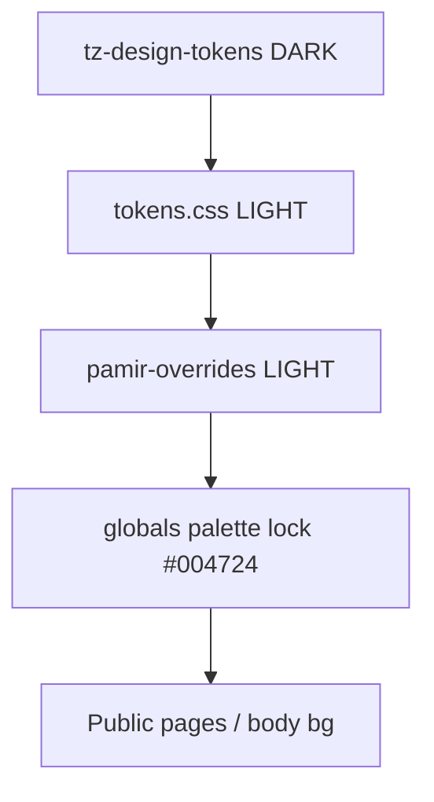

# Phase 1 — UI Audit: Desktop Visual Redesign

**Date:** 2026-08-10  
**Scope:** Strictly **READ-ONLY** on application code — audit document only  
**Decisions locked:** Palette 1A (TZ emerald canon) · Delivery 2A (phases 1–8, start 1–4)  
**Status:** Complete — **STOP. Do not start Phase 2 until explicit command.**

### Phase 1 constraints (confirmed)

| Allowed | Forbidden |
|---------|-----------|
| Read files, grep usages, analyze cascade/breakpoints/components | Edit `tokens.css`, `globals.css`, any CSS/TS/TSX |
| Create **only** this audit document | Edit layouts, pages, i18n, config, backend, API, Prisma |
| | Mass hex find-replace; mass `premium-*` rebind |

**Git check:** only untracked `docs/ui-audit-desktop-redesign.md` — no `src/` modifications.

### Additional locked rules (post-plan refinements)

1. Canonical palette applies to **Design System / UI tokens** first — not mechanical repo-wide hex replace. Classify brand assets / SVG / logo / illustrations separately (§2.4).
2. `#0F6B4C` (Verdant Peak) is **not automatically an error** — migrate when it is a UI token; leave brand raster assets until intentional brand update.
3. **No mass `premium-*` rebind in Phase 2** until dependency map (§1.5) is respected — prefer neutralize `globals.css` lock + rewrite `tokens.css`; touch premium files only with proven consumers.
4. User Menu must preserve **role matrix** Guest / Owner / Admin (§4.5) — especially conditional Admin Panel.
5. After Phase 1 → report + stop (this document).

---

## 0. Executive summary

The product does **not** lack a design system — it has **too many competing ones**. Mid-stack Verdant Peak / Pamir light tokens are overridden by a late **`globals.css` dark emerald lock (`#004724`)** that runs *after* all `@import`s. That cascade, plus orphaned premium/TZ dark sheets and a hardcoded `data-theme="dark"`, explains the “draft dark template” look on production.

| Finding | Severity | Phase |
|---------|----------|-------|
| `globals.css` palette lock `#004724 !important` beats pamir light | Critical | 2 (first) |
| `tz-design-tokens.css` seeds dark `#0a1f14` as first import | High | 2 alias bridge |
| `premium-shell` / `premium-overhaul` still feed live classes | High | **analyze first**; limited touch in 2; delete in 8 |
| Header chrome at `md` (768), not 1200 — tablet would break if moved blindly | Critical | 4 (addressable) |
| `MobileMenu.tsx` is **orphaned** (not wired to Header) | High | 4 scope clarification |
| Mobile “user menu” today = avatar → `/profile` + `ProfileHubView` + bottom tabs | High | 4 |
| UserMenu: role matrix Guest/Owner/Admin; no Escape / focus trap | Medium | 4 |
| `HOTEL_MODERATOR` has **no** UserMenu panel entry | Medium | 4 product note |
| No `TajikPattern`, no shared `ErrorState` | Medium | 3 |
| Admin payment/security/finance strings hardcoded English | Medium | 6 |
| `GlassCard`, `DataTable`, `Skeleton` ≈ 0; `HubLinkCard` orphan; `ui/Button` unused | Low | 3/8 |

**Business logic impact of Phase 1:** none (docs only).

---

## 1. CSS dependency graph

### 1.1 Import order (`src/app/globals.css`)

```
1.  tz-design-tokens.css     ← DARK seed (#0a1f14)
2.  tz-typography.css
3.  tz-atoms.css             ← dark-leaning consumers
4.  tokens.css               ← Verdant Peak LIGHT SoT (pre-TZ-canon)
5.  variables.css            ← light alias bridge
6.  taj-theme.css            ← light surfaces (both data-themes)
7.  ds-components.css
8.  home.css                 ← labeled dark emerald
9.  home-pamir.css           ← light Pamir home
10. auth.css
11. auth-premium.css         ← page-local dark (#03140f)
12. mobile-drawer.css
13. premium-shell.css        ← dark hub glass
14. premium-overhaul.css     ← large dark overhaul
15. mockup-shell.css
16. home-mobile-first.css
17. profile-hub.css
18. admin-mobile-app.css
19. btn-glass.css
20. chat.css
21. splash-screen.css
22. owner-calendar.css
23. pamir-overrides.css      ← last import: force light
    ── then ~3k lines of globals.css ──
24. Tailwind layers
25. “FINAL PREMIUM GREEN PASS” + **palette lock #004724 !important**  ← RUNTIME WINNER
```

### 1.2 Who wins on desktop public pages



1. Pamir sets `body { background: var(--taj-mist) !important }` and light cards.
2. Later in the **same** `globals.css` file, brand palette lock reasserts:
   - `--bg-base: #004724 !important`
   - `--taj-app-bg: linear-gradient(... #004724 ...)`
   - `html/body { background: var(--taj-app-bg) !important }`
3. More specific Pamir selectors (`.hotel-card-pamir`, hero search) still win locally → mixed light cards on dark chrome.

### 1.3 Theme attribute

[`src/app/layout.tsx`](../src/app/layout.tsx): `<html data-theme="dark">` hardcoded.  
`taj-theme.css` / pamir treat `light` and `dark` identically (light tokens). Attribute is a **label**, not a real theme switch. Globals lock paints dark regardless.

### 1.4 Dark hex still defined as truth

| Hex | Source | Role after cascade |
|-----|--------|--------------------|
| `#0a1f14` | `tz-design-tokens.css` `--bg-app` | Early seed; often rebound |
| `#112a1b` / `#163521` / `#1c4028` | TZ surfaces | Early seed |
| `#004724` | **globals.css palette lock** + `--ds-bg-main` | **Active chrome winner** |
| `#012f1a` | globals deep / gradients | Active |
| `#03140f` | `auth-premium.css` | Auth page local |
| `#032d1f` | `mobile-drawer.css` | Drawer |

Also: `viewport.themeColor` teal remnant in layout (not TZ emerald).

### 1.5 Legacy CSS dependency maps (required before any rebind)

**Import consumers:** all three sheets are loaded **only** via `src/app/globals.css` (global). No component imports them directly — impact is **class/variable based**, site-wide.

#### A) Canonical UI chain (Design System)

```text
tokens.css  (+ taj-theme / variables aliases)
   ↓
ds/Button · ds/Input · ds/AppCard · taj-btn* (raw)
   ↓
HotelCard · Header · UserMenu · EmptyState* · DashboardShell
   ↓
Home (/) · Search · Hotel detail · Favorites · Profile · Admin/Owner layouts
```

#### B) Who paints dark — runtime winner

```text
tz-design-tokens.css (early dark seed)
   ↓ (overwritten by)
tokens.css + variables.css + taj-theme.css + pamir-overrides.css
   ↓ (defeated by)
globals.css palette lock (#004724 !important)  ← primary desktop darkness source
   + PageBackdrop.tsx canvas fill #004724
   + splash-screen.css gradients
```

#### C) `premium-shell.css`

| Class / token | Direct TSX consumers | Pages / surfaces |
|---------------|---------------------|------------------|
| `.app-screen-header*` | `ScreenHeader.tsx` → `ProfileSubpageShell.tsx` | Profile subpages (settings, security, …) |
| `.app-hub-card*` | `HubLinkCard.tsx` only | **Orphan** — HubLinkCard never imported by pages |
| `.taj-display` / `.taj-title` / `.taj-body` / `.taj-caption` | Utility classes (grep light) | Available globally; dark fallbacks `#ecfdf5` |
| `--taj-text` fallbacks in shell | BrandMark, sidebars, forms | Shared desktop+mobile |

**Desktop impact:** typography utilities + profile subpage headers.  
**Mobile impact:** same (profile hub / subpages).  
**Phase 2:** do **not** mass-rebind; if touching shell, limit to fallback colors on used classes after token SoT wins.

#### D) `premium-overhaul.css`

| Class | Direct consumers | Notes |
|-------|------------------|-------|
| `.premium-input` | Profile*Client/Form (email, password, name, settings, single-field) | Profile edit forms — **mobile+desktop shared** |
| `.premium-badge` | `hotel/[id]/page.tsx`, profile security, pamir override | Hotel detail + profile |
| `.premium-card` | Mostly CSS-defined; limited TSX | Animation/card chrome |
| `.hotel-card-premium--motion` | `globals.css` + HotelCardShell motion path | Card reveal (shared) |
| Keyframes `fadeUp` / `slideUp` / `skeletonPulse` | Consumed by overhaul classes | Side-effect if file removed |

**Desktop impact:** hotel detail badge, profile forms, card motion.  
**Mobile impact:** same profile forms (high).  
**Phase 2:** **no mass rebind**. Prefer leaving file; migrate consumers gradually in Phase 3–5 to `ds/Input`.

#### E) `tz-design-tokens.css`

| Imported by | Variable consumers |
|-------------|-------------------|
| `globals.css` only (first) | `--bg-app`, `--bg-card`, `--green-*`, `--text-*`, `--z-*`, bridges to `--taj-*` |
| Then overwritten by `tokens.css` / `variables.css` / **globals lock** | Early seed still matters for anything that reads TZ vars before later layers |

**Phase 2:** convert to thin alias bridge → canonical; do not delete until aliases proven.

#### F) Shared vs desktop-only vs mobile-only (chrome)

| Surface | Shared | Desktop-only (`md+`) | Mobile-only |
|---------|--------|----------------------|-------------|
| Colors / tokens | Yes (global) | — | — |
| Header nav / UserMenu / Locale | — | Yes | — |
| HeaderMobileActions / BottomNav | — | — | Yes |
| HotelCard / Button tokens | Yes | density ≥1200 later | — |
| ProfileHub + premium-input | Yes | — | primary UX |
| Admin mobile shell | — | — | ≤1023 |
| `MobileMenu` drawer | styles exist | — | **orphaned component** |

---

## 2. Token conflict inventory

### 2.1 Naming families (three+ systems)

| Family | Examples | Intent |
|--------|----------|--------|
| Verdant Peak | `--taj-ink`, `--taj-mist`, `--taj-lake` | Light green+white (current DESIGN.md) |
| Semantic | `--taj-color-primary`, `--taj-color-text` | Role aliases → Peak |
| TZ dark Part 1.1 | `--bg-app`, `--green-primary`, `--text-primary` | Dark hospitality |
| Premium | `--bg-card`, `--green-accent` | Dark premium v2 |
| DS legacy | `--ds-primary`, `--ds-bg-main` | Partially remapped; lock forces `#004724` |

Ambiguity: `--taj-text` (color) vs `--taj-text-sm` (font-size).

### 2.2 Migration map (locked for Phase 2)

Canonical palette (absolute):

| Role | Hex |
|------|-----|
| Primary Emerald | `#087F5B` |
| Dark Emerald | `#065F46` |
| White | `#FFFFFF` |
| Near Black | `#111827` |
| Secondary text | `#6B7280` |
| Border | `#E5E7EB` |
| Soft background | `#F8FAFC` |

| Legacy token | → Canonical | Value |
|--------------|-------------|-------|
| `--taj-lake`, `--taj-color-primary`, `--ds-primary`, `--green-primary` | Primary Emerald | `#087F5B` |
| `--taj-lake-deep`, `--taj-color-primary-hover`, `--green-dim` | Dark Emerald | `#065F46` |
| `--green-accent`, `--green-bright` | Primary / soft wash | no neon |
| `--taj-snow`, elevated `--bg-card` | White | `#FFFFFF` |
| `--taj-mist`, `--bg-base`, `--app-bg` | Soft bg | `#F8FAFC` |
| `--taj-ink`, `--taj-color-text`, light `--text-primary` | Near black | `#111827` |
| `--taj-ink-soft`, secondary text tokens | Secondary | `#6B7280` |
| `--taj-line`, `--border-default` | Border | `#E5E7EB` |
| TZ `--bg-app` `#0a1f14`, dark `--text-primary` `#e8f5ee` | Soft / Near black | re-point aliases |
| `--shadow-green` / glow | Subtle graphite | no green glow |
| TZ `--z-*` (100…400) | ТЗ §11 | header 100 → toast 500 |
| `--taj-page-max` | Container | 1440px / 1600px large |
| Nunito/Inter in TZ font vars | DM Sans UI + Playfair display | keep existing font stack |

**Rule:** keep `--taj-*` **names** as aliases; change **values**; do not invent a third naming family.

### 2.4 Hex classification — do NOT mechanical replace

| Hex | Classification | Action |
|-----|----------------|--------|
| `#087F5B` / `#065F46` | Canonical TZ UI | Target for UI tokens |
| `#0F6B4C` / `#0A4D37` | Verdant Peak **UI tokens** in `tokens.css`, `taj-theme.css`, pamir gradients | Migrate **token values** in Phase 2 — expected |
| `#0F6B4C` in raster logo / OG / favicon under `/brand/` | **Brand asset** (PNG) | Do **not** auto-recolor files; separate brand task if needed |
| `#004724` / `#012f1a` / `#006b38` | Legacy dark chrome (globals lock, splash, PageBackdrop) | Neutralize in Phase 2 UI layer |
| `#14825c` (`--green-accent`) | Intermediate accent | Map to canonical / soft wash |
| `#03140f` | Auth-premium local | Phase 5 auth visual — not Phase 2 mass replace |
| Gold `#c9a84c` (TZ) | Logo/premium accent remnant | Keep unless conflicts; not primary UI |

**Principle:** Canonical palette = Design System + UI layer. Brand PNGs / illustrations / marketing assets = classify first, change only with explicit brand decision.

### 2.5 Phase 2 vs Phase 8 file disposition

| File | Phase 2 action | Phase 8 |
|------|----------------|---------|
| `tokens.css` | Rewrite as **canonical SoT** (TZ palette) | Keep |
| `DESIGN.md` + `tajstay-design/SKILL.md` | Align to TZ canon; retire Verdant Peak as competing brand | Keep |
| `tz-design-tokens.css` | Thin **alias bridge** only (no dark hex as truth) | Delete if unused |
| `variables.css` | Consolidate legacy → canonical | Keep as bridge |
| `tz-typography.css` / `tz-atoms.css` | Remap to canonical | Keep or fold |
| `taj-theme.css` / `ds-components.css` | Point at canonical | Keep |
| `btn-glass.css` / `mockup-shell.css` | Token surfaces | Fold/delete if obsolete |
| **`globals.css` palette lock / FINAL PREMIUM PASS** | **Must neutralize** or Phase 2 is invisible | Delete lock blocks |
| `layout.tsx` `data-theme` | Flip to `light` (or remove) once lock gone | Done |
| `premium-shell.css` / `premium-overhaul.css` | **Leave intact** in Phase 2 (dependency map §1.5); no mass rebind | Delete/fold after unused |
| `PageBackdrop.tsx` | Optional surgical fill if still dark after lock removal | Align to soft bg |
| `home.css` (dark) | Leave structure | Delete when pamir owns home |
| `auth-premium.css` | Leave for Phase 5 auth visual | Rewrite/delete |
| `pamir-overrides.css` | Keep until lock removed | Fold into theme |

---

## 3. Component inventory

### 3.1 Design System (`src/components/ds/`)

Exports (barrel): `Button`, `Input`, `Textarea`, `AppCard`, `StatCard`, `EmptyStateCard`, `ActionCard`, `FormSection`, `FormField`, `PartnerPropertyCard`, `BookingCard`, `PageContainer`, `SectionContainer`, `DashboardShell`, `DashboardSection`, `ContentGrid`, `StickyActions`, `Stack`, `Cluster`, `FilterChip`.

### 3.2 UI layer (`src/components/ui/`)

| File | Role | Import sites (approx.) |
|------|------|------------------------|
| `Button.tsx` | Re-export ds | **0** (unused path) |
| `Input.tsx` | Re-export ds | 0 direct |
| `EmptyState.tsx` | Wraps EmptyStateCard | 3 |
| `EmptyStateCard` (ds) | Canonical empty | 5 |
| `Modal.tsx` | Overlay | 1 (+ `z-[10050]`) |
| `GlassCard.tsx` | Orphan | **0** |
| `DataTable.tsx` | Orphan | **0** |
| `Skeleton.tsx` | Exported, unused | **0** |
| `StatusBadge` / `BookingStatusBadge` | Used | via barrel |
| `DataToolbar`, `Pagination`, `Switch`, `Tag`, `AppImage`, `SensitiveActionConfirmDialog` | Feature UI | varied |

Third entry: `src/shared/ui/` re-exports DS (`BookingWizard` uses it).

### 3.3 High-risk / key chrome

| Component | Path | Sites | Notes |
|-----------|------|------:|-------|
| `Button` (ds) | `ds/Button.tsx` | low import, **~12 raw `taj-btn`** | Refactor carefully |
| `HotelCard` | `components/HotelCard.tsx` | 3 | `hotel-card-pamir*`; CTA raw `taj-btn` |
| `Header` | `layout/Header.tsx` | 1 (root layout) | Nav: Home / Search / About |
| `UserMenu` | `layout/UserMenu.tsx` | 1 | Desktop only (`md:block`) |
| `LocaleSwitcher` | `layout/LocaleSwitcher.tsx` | 1 | `md:flex` |
| `HeaderMobileActions` | `layout/HeaderMobileActions.tsx` | 1 | Avatar → `/profile` OR auth modal |
| `MobileMenu` | `layout/MobileMenu.tsx` | **0** | **Orphan** — full drawer unused |
| `MobileBottomNav` | `layout/MobileBottomNav.tsx` | layout | Tabs: home/search/favorites/bookings/profile |
| `ProfileHubView` | `profile/ProfileHubView.tsx` | profile page | De-facto mobile account hub |
| `DashboardShell` | `ds/DashboardShell.tsx` | 4 layouts | Admin/owner/moderator |
| `BrandMark` | `brand/BrandMark.tsx` | 3 | Header/Footer/Admin mobile |

### 3.4 Missing primitives (Phase 3)

- `TajikPattern` (`subtle` | `divider` | `footer`) — **does not exist**
- Shared `ErrorState` — **does not exist** (`app/error.tsx` is dark ad-hoc)
- Shared dropdown primitive with Escape / outside / z-token — fragmented

### 3.5 Duplicate / parallel surfaces

- Modals: `ui/Modal`, `AuthEntryModal`, admin review/reject modals, `SensitiveActionConfirmDialog`
- Cards: DS `AppCard` family vs domain `HotelCard`, `HubLinkCard`, `TripBookingCard`, mockup cards
- Empty: `EmptyState` → `EmptyStateCard` + `OwnerEmptyState`
- Buttons: DS component underused; raw `taj-btn` / `btn-primary` widespread

**Hard rule for Phase 3:** refactor existing `ds/Button`, `ds/Input`, `ui/EmptyState`, etc. — no `NewButton` / `ModernCard`.

---

## 4. Navigation & User Menu (Phase 4 inputs)

### 4.1 Desktop Header today

Structure: `[BrandMark] [HeaderNav: Home·Search·About] [Locale | Bell | UserMenu]`  
Container: `max-w-[var(--taj-page-max)]` + `--taj-page-px`  
Desktop chrome gate: **`md` (768px)** — not 1200.

### 4.2 TZ desired vs current nav

| TZ | Current | Action (Phase 4, visual + labels only) |
|----|---------|----------------------------------------|
| Главная `/` | Yes | Keep |
| Отели | Missing (closest `/search`) | Map “Отели” → existing `/search` (no new route) |
| Избранное | Only in UserMenu | Add to HeaderNav desktop ≥1200 if product OK |
| Бронирования | Only in UserMenu | Add to HeaderNav desktop ≥1200 |
| О сервисе | Extra vs TZ | Keep or demote — product call; prefer keep link in footer |

### 4.3 UserMenu (desktop)

File: [`UserMenu.tsx`](../src/components/layout/UserMenu.tsx)

**Present:** click-outside close; `aria-expanded`; `role="menu"`; groups (header / notifications / account links / owner-admin / logout); CSS fade/scale.

**Gaps vs TZ:**

- Not right-edge anchored floating panel (free-floating under avatar)
- No slide-from-right (`translateX`) animation as specified
- No Escape handler; no focus trap; incomplete `menuitem` on owner/admin links
- z-index not on token scale
- Grouping/separators/icons need visual redesign to emerald system

### 4.4 Mobile user menu — critical scope finding

| Surface | Wired? | Behavior |
|---------|--------|----------|
| `UserMenu` | Desktop only (`hidden md:block`) | Dropdown |
| `MobileMenu` drawer | **Not imported anywhere** | Dead code + CSS still in bundle via styles |
| `HeaderMobileActions` | Yes | Logged-in → **Link to `/profile`** (no panel) |
| `MobileBottomNav` | Yes | Tab: profile → `/profile` |
| `ProfileHubView` | Yes | Full-page account hub with menu rows |

**Implication for Phase 4 mobile exception:**  
ТЗ assumes a “правое пользовательское меню”. In current code the right drawer (`MobileMenu`) is **orphaned**. Options for Phase 4 (choose at Phase 4 kickoff, do not invent routes):

1. **Preferred (preserve mechanism):** Visually restyle `UserMenu` for desktop; for mobile, visually align **`ProfileHubView` menu rows** (and/or re-wire `MobileMenu` only if product confirms restoring the drawer) without changing bottom-nav / avatar→profile navigation.
2. **If re-enabling `MobileMenu`:** treat as wiring restore + visual DS — still no route/logic change; keep existing drawer open/close mechanics inside the component.

Do **not** change `MobileBottomNav` structure in Phase 4.

### 4.5 UserMenu role matrix (DO NOT break in Phase 4)

Source: [`UserMenu.tsx`](../src/components/layout/UserMenu.tsx) + [`getOwnerApplicationNavState`](../src/lib/navigation/getNavContext.ts).  
Permissions: role string from session (`GUEST` | `OWNER` | `ADMIN` | `HOTEL_MODERATOR`). Owner-application UX only queries DB when `role === "GUEST"`.

#### Always (all authenticated roles)

| Item | Route / action | Conditional? | Visual-only OK? |
|------|----------------|--------------|-----------------|
| Header: name + “account” + TrustBadges | — | No | Yes (layout/style) |
| Notifications block / empty | `/notifications`, mark-read API | Data-driven | Yes |
| Profile | `/profile` | No | Yes |
| Bookings | **Owner** → `/dashboard/owner`; **else** → `/dashboard/bookings` | **Route by role** | Style yes; **href logic no** |
| Favorites | `/favorites` | No | Yes |
| Logout | `POST` logout flow in component | No | Style yes; behavior no |

#### Guest (`role === "GUEST"`) — owner application block

| `ownerApp.kind` | Item | Route | Must preserve |
|-----------------|------|-------|---------------|
| `none` | Become owner | `/profile/become-owner` | Show condition |
| `pending` | Pending status link | `/profile/become-owner` | Show condition |
| `approved` | Owner approved → panel | `/dashboard/owner` | Show condition |
| `rejected` | Rejection text + Apply again | `/profile/become-owner` | Show + comment |
| (any) | Admin Panel | — | **Must NOT show** |
| (any) | Owner Panel (OWNER label) | — | **Must NOT show** (unless approved link above) |

#### Owner (`role === "OWNER"`)

| Item | Route | Must preserve |
|------|-------|---------------|
| Owner Panel | `/dashboard/owner` | Show when OWNER |
| Become-owner / pending / rejected guest flows | — | **Must NOT show** (`getOwnerApplicationNavState` returns `none` for non-GUEST) |
| Admin Panel | — | **Must NOT show** |

#### Admin (`role === "ADMIN"`)

| Item | Route | Must preserve |
|------|-------|---------------|
| **Admin Panel** | `/dashboard/admin` | **`role === "ADMIN"` only** — privileged block |
| Owner Panel | — | **Must NOT show** |
| Guest become-owner flows | — | **Must NOT show** |

#### Hotel moderator (`role === "HOTEL_MODERATOR"`)

| Item | Behavior today |
|------|----------------|
| Profile / Favorites / Bookings | Same as non-owner: bookings → `/dashboard/bookings` |
| Moderator dashboard link | **Missing** from UserMenu (moderator uses `/dashboard/moderator` via other entry points / redirects) |
| Admin / Owner panels | Hidden |

**Phase 4 constraint:** redesign grouping/icons/animation/a11y only. Do not collapse role branches, do not show Admin Panel to non-ADMIN, do not change booking href role split without explicit product approval.

---

## 5. Breakpoint map

Tailwind defaults (no custom screens): `sm 640` · `md 768` · `lg 1024` · `xl 1280`.  
**No existing `min-width: 1200`.** Closest token step: `--taj-page-px` at 1280.

### 5.1 MUST keep current breakpoints (tablet preservation)

| Location | Breakpoint | Why |
|----------|------------|-----|
| Header locale / auth / UserMenu / Bell | `md` 768 | Chrome swap |
| HeaderNav visibility | `md` 768 | Nav appears |
| HeaderMobileActions / MobileBottomNav | `md:hidden` | Mobile chrome |
| MobileMenu (if restored) | `md:hidden` | Drawer |
| SiteHeaderFrame scroll-hide | `max-width: 1023` | Paired with `home.css` |
| Admin mobile shell | `lg` / 1023 | Double-header risk |

Moving these to 1200 creates a **dead zone 768–1199** (no drawer, no desktop nav).

### 5.2 SAFE for NEW desktop redesign gate (`min-width: 1200px`)

Additive layout density only:

- Header **visual** restyle (logo size, container 1440/1600, nav indicator, padding 32/48)
- Optional extra HeaderNav items (Favorites/Bookings) shown only ≥1200 while tablet keeps current 3-link `md` nav
- Home hero / search bar desktop composition
- HotelCard grid columns / page gutters for large monitors
- Footer max-width polish

Pattern: keep `md:` for chrome presence; add `min-[1200px]:` (or CSS `@media (min-width: 1200px)`) for **new** desktop DS rules.

### 5.3 Page surfaces heavy on lg/xl (Phase 5–6)

- Home: hero `@media 1024`, SearchBar `lg:grid-cols-5`
- Search: sticky map `lg:col-span-2 lg:sticky lg:top-24`
- Admin: stats `xl:grid-cols-4`, tables `lg:grid`, shell `lg:hidden`

---

## 6. Major guest / dashboard surfaces (Phase 5–6 backlog)

### Guest funnel

| Route | Notes |
|-------|-------|
| `/` | home-pamir + home.css conflict |
| `/search` | SearchExperience + HotelCard |
| `/hotel/[id]` | Detail |
| `/booking`, `/payment/[code]` | Funnel |
| `/favorites` | HotelCard grid |
| `/profile` (+ settings/account/…) | ProfileHubView mockup styles |
| `/dashboard/bookings`, `/dashboard/guest` | Trips |
| `/notifications`, `/chat/booking/[id]` | |
| `/auth/*` | auth-premium dark island |
| `/about`, `/contacts`, `/faq`, legal | Marketing |

### Owner / Admin (Phase 6)

Layouts via `DashboardShell` + sidebars. Admin page hardcodes EN payment catalog / security / finance (see §7). Tables use ad-hoc markup (DataTable unused).

---

## 7. i18n leakage (Phase 6 — do not fix in 1–4)

`messages.ts` admin trees are balanced (ru/tg/en ≈ 163 keys each). Leakage is **hardcoded JSX**, not missing keys.

### [`src/app/dashboard/admin/page.tsx`](../src/app/dashboard/admin/page.tsx)

- `Payment methods catalog` / `Save payment catalog` / catalog description
- `Admin security (login and password)` + field labels (`New phone login`, `Current password`, …)
- `Save admin security` / `Emergency reset…`
- `Finance` section (note: `admin.finance` **exists** in i18n but unused)
- `Payments` / `Payouts` / `Refunds` / empty copy / `Guest:` / `Owner:` …

### Admin components (errors / a11y)

- `AdminPropertyTypesPanel.tsx`: `Load/Save/Update/Delete failed`
- Owner application / hotel moderation: `Failed` / `Failed to load`
- `AdminMobileBottomNav`: `aria-label="Admin"`
- `HeaderNav`: `aria-label="Main"`

Support/legal blocks on admin page also bypass `m()` (hardcoded RU).

---

## 8. Z-index & motion debt

| Value | Location | Target (ТЗ §11) |
|------:|----------|-----------------|
| 10050 | `ui/Modal.tsx` | modal 400 |
| 10002 / 10001 | `MobileMenu.tsx` | overlay/dropdown band |
| 1101 / 1100 / 1001 / 1000 | `admin-mobile-app.css` | redesign stack |
| 50 | header | header 100 |
| TZ tokens 100…400 | unused by overlays | adopt |

UserMenu motion: opacity/scale; TZ wants opacity + `translateX(20→0)` 180–240ms.

---

## 9. Regression risk register (Top 10)

1. **Neutralizing globals `#004724` lock** — sitewide bg/contrast shift; verify Pamir cards, auth, splash, PWA themeColor.
2. **Moving header chrome from 768 → 1200** — tablet dead zone (forbidden).
3. **Scroll-hide 1023 mismatch** — JS (`SiteHeaderFrame`) vs CSS (`home.css`) must stay paired.
4. **Admin mobile shell at 1024** — double header / blank chrome if only half updated.
5. **Mobile drawer z-index** if `MobileMenu` re-wired — vs header 50, tab bar 45, Modal 10050.
6. **Auth-premium island** — may stay dark while public goes light until Phase 5.
7. **Search sticky `lg:top-24`** — breaks if header height changes.
8. **Raw `taj-btn` call sites** — Button token changes affect HotelCard/home without importing DS Button.
9. **`data-theme="dark"` flip** — any selector still assuming dark text on dark bg.
10. **Profile hub / mockup-shell** — mobile account UX shares tokens; color migration is global.

---

## 10. Phase 2–4 scoped file list

### Phase 2 (tokens) — narrow, no mass premium rebind

**Do first (required for tokens to win):**
- `src/styles/tokens.css` — canonical rewrite (TZ palette values)
- `src/styles/tz-design-tokens.css` — thin alias bridge (no dark hex as truth)
- `src/styles/variables.css` — consolidate aliases
- `src/styles/taj-theme.css` — remap hex/vars to canonical
- `src/app/globals.css` — **neutralize palette lock + FINAL PREMIUM dark pass only** (surgical)
- `src/app/layout.tsx` — `data-theme` → light / remove
- `DESIGN.md`, `.agents/skills/tajstay-design/SKILL.md` — align to TZ canon

**Do NOT in Phase 2 without per-class plan:**
- Mass rewrite of `premium-shell.css` / `premium-overhaul.css`
- Repo-wide hex replace of `#0F6B4C` in assets
- Deleting premium/home/auth-premium files

**Soft optional (only if lock neutralization leaves broken contrast on proven consumers):**
- `PageBackdrop.tsx` fill colors (UI backdrop, not logo)
- Fallback colors on `.taj-title` / shell utilities — minimal

### Phase 3 (core components)

- `src/components/ds/Button.tsx`, `Input.tsx`, `AppCard.tsx`, `EmptyStateCard.tsx`  
- `src/components/ui/EmptyState.tsx`, `Modal.tsx`, `Skeleton.tsx`  
- **New:** `TajikPattern`, `ErrorState`, shared `Dropdown`/`Separator` under `ds/` or `ui/`  
- CSS: `ds-components.css` focus/radius alignment  

### Phase 4 (navigation)

- `Header.tsx`, `HeaderNav.tsx`, `SiteHeaderFrame.tsx`, `BrandMark`  
- `UserMenu.tsx` (+ styles in home/globals)  
- `LocaleSwitcher.tsx`  
- Mobile exception: `ProfileHubView` visual **and/or** decide restore of `MobileMenu.tsx`  
- Header-related CSS in `home.css` / pamir — **desktop `@media (min-width: 1200px)` only for new rules**  
- Do **not** edit `MobileBottomNav` structure  

### Explicitly out of Phase 1–4

- Guest page redesign (Phase 5), Owner/Admin visual + i18n (Phase 6)  
- Deleting `premium-overhaul.css` / `home.css` wholesale  
- Global `md` → `xl` / `1200` replacement  
- API / Prisma / auth / booking logic  

---

## 11. Phase 1 exit checklist

- [x] Phase 1 strictly read-only on `src/` (only this doc created)
- [x] CSS cascade / competing systems documented
- [x] Legacy dependency maps (`tz` / `premium-shell` / `premium-overhaul`) documented
- [x] Token migration map locked for Phase 2
- [x] Hex classification: UI tokens vs brand assets
- [x] Component inventory + usage / orphans
- [x] Breakpoint policy: chrome @768/1024 keep; new DS @1200 additive
- [x] User menu desktop gaps + mobile orphan drawer
- [x] UserMenu role matrix Guest / Owner / Admin (+ moderator note)
- [x] Admin i18n backlog listed
- [x] Regression risks listed
- [x] Phase 2–4 file scope listed (Phase 2 narrowed: no mass premium rebind)
- [x] No backend / API / DB / business logic changed
- [x] **STOP — do not auto-start Phase 2**

---

## 12. Stop — awaiting command

Phase 1 is complete. **Do not begin Phase 2** until an explicit user command (e.g. `начинай Phase 2`).

When Phase 2 is authorized, preferred order:

1. Rewrite `tokens.css` to TZ canon (+ DESIGN.md / skill).  
2. Convert `tz-design-tokens.css` to alias bridge.  
3. **Surgically neutralize `globals.css` palette lock** (otherwise tokens never win).  
4. Set `data-theme="light"` (or remove).  
5. Spot-check home / header / hotel card / profile on desktop **and** mobile 375px — **without** mass `premium-*` rebind.  
6. Report Phase 2 results; proceed to Phase 3 only on command.
